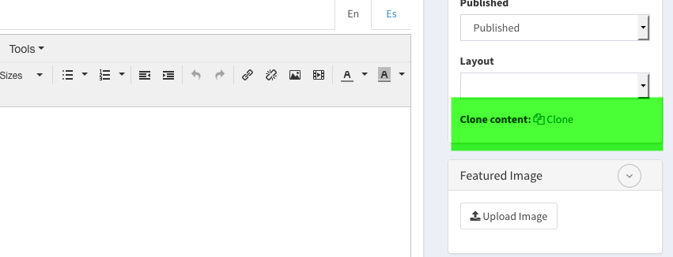

# Camaleon CMS - Post Clone
This is a Camaleon CMs Plugin which permit you to clone contents the current content with all related information.
The cloned content will include: categories, tags, custom fields (if enabled), custom settings,... and it will be saved as draft (if configured) or published (default).



## Installation
* Add to your Gemfile
```
gem "camaleon_post_clone"
```
* Install gem
```
bundle install
```
* Restart Server and activate the plugin: Admin -> plugins -> Camaleon Post Clone
* Configure the plugin by 'Settings' below the plugin title
* Edit any content and clone with the option in the right bar