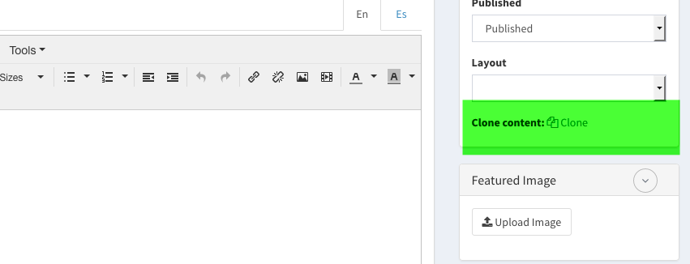

# Camaleon CMS - Post Clone
This is a Camaleon CMs Plugin which permit you to clone contents the current content with all related information.
The cloned content will include: categories, tags, custom fields (if enabled), custom settings,... and it will be saved as draft (if configured) or published (default).



## Installation
* Add to your Gemfile
```
gem "camaleon_post_clone"
```
* Install gem
```
bundle install
```
* Restart Server and activate the plugin: Admin -> plugins -> Camaleon Post Clone
* Configure the plugin by 'Settings' below the plugin title
* Edit any content and clone with the option in the right bar

## Development

The suite runs against a camaleon_cms-backed dummy Rails app under `spec/` (the Ruby version comes
from `.tool-versions`):

```bash
bundle install
(cd spec/dummy && RAILS_ENV=test bin/rails db:test:prepare)
bin/rspec
```

Lint with the same configuration CI enforces:

```bash
bin/rubocop
```

## Releasing

Bump `lib/camaleon_post_clone/version.rb`, cut a `## <version>` section in `CHANGELOG.md`, merge,
then run the **Release** workflow from the Actions tab on `master`, typing that same version. The
workflow refuses to run without a green CI run for the released commit, publishes the gem to
RubyGems, and creates the tag and GitHub release.
